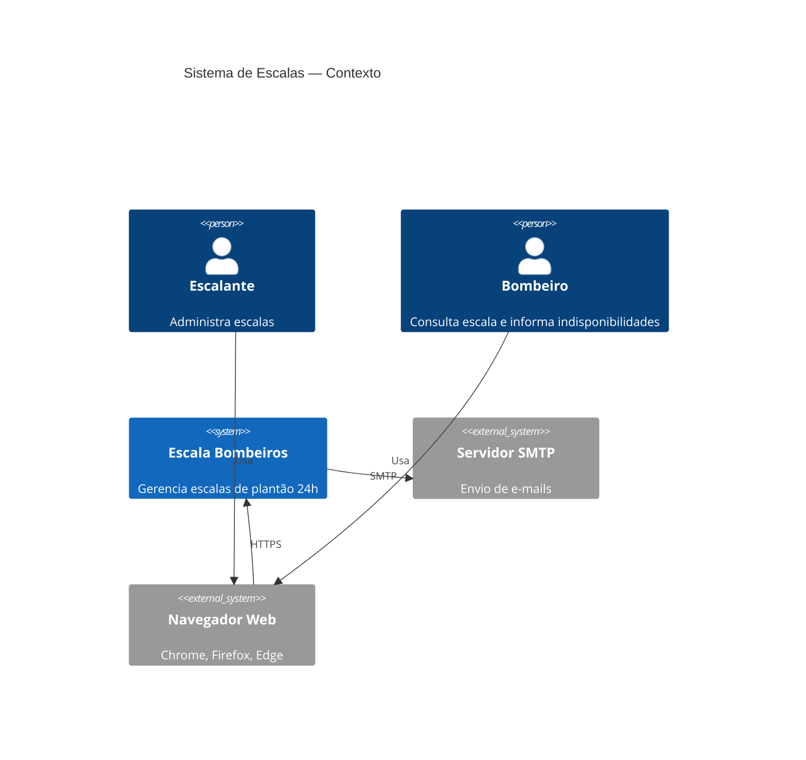
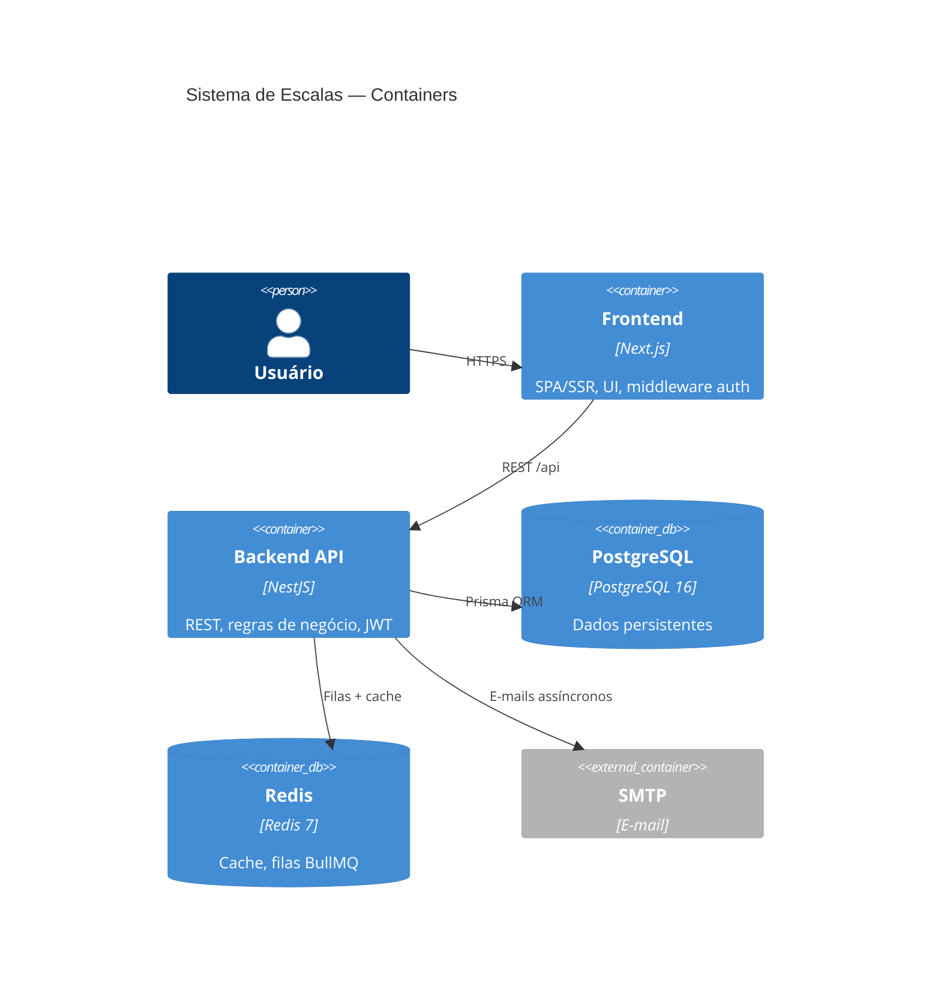
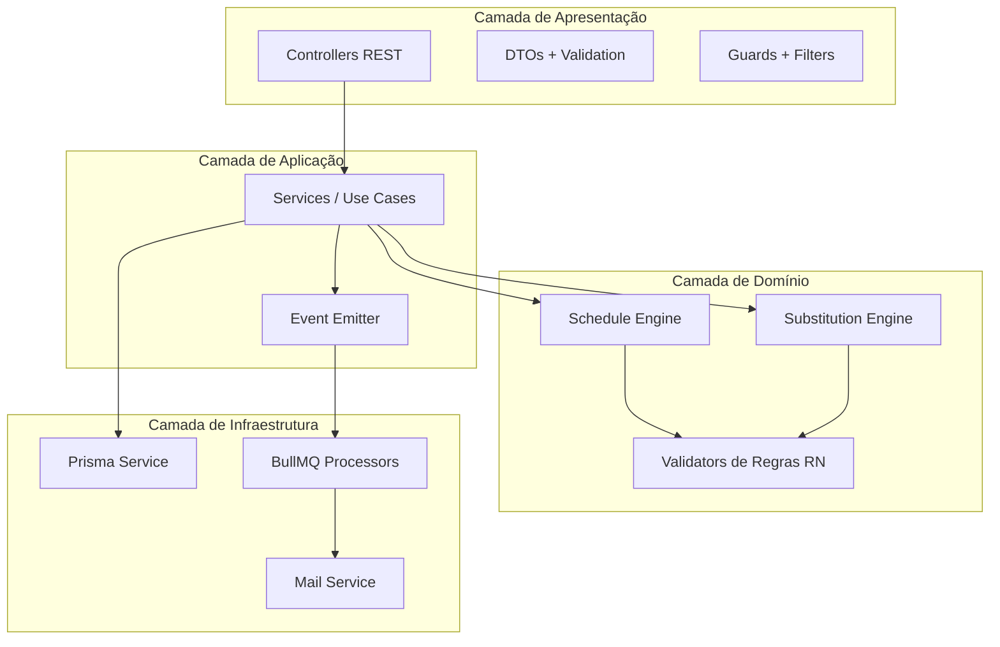
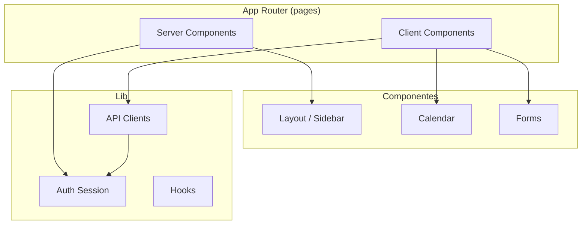
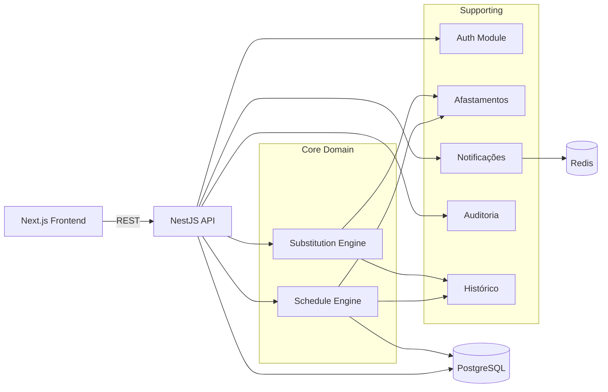
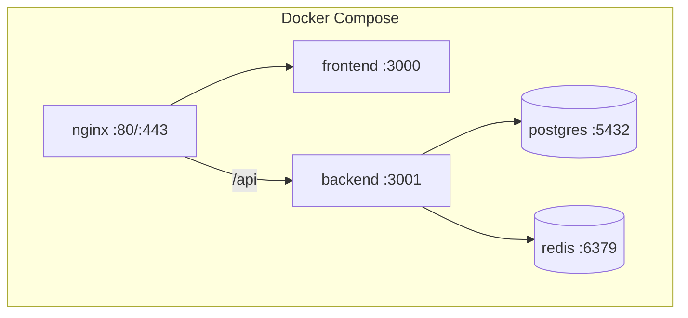

# Arquitetura da Aplicação

**Versão:** 1.0  
**Papel:** Arquiteto de Software Sênior  

---

## 1. Visão Executiva

Sistema web composto por **Frontend Next.js**, **Backend NestJS** e infraestrutura de suporte (**PostgreSQL**, **Redis**, **SMTP**), containerizado com Docker. Arquitetura **monólito modular** otimizada para 13 usuários concurrentes com regras de negócio complexas no motor de escalação.

---

## 2. Diagrama de Contexto (C4 — Nível 1)

---

## 3. Diagrama de Containers (C4 — Nível 2)

---

## 4. Estilo Arquitetural

| Decisão | Escolha | Justificativa |
|---------|---------|---------------|
| Estilo | Monólito modular | Porte pequeno, deploy simples, regras coesas |
| Frontend | Next.js App Router | SSR parcial, middleware, rotas por perfil |
| Backend | NestJS | Módulos, DI, guards, testabilidade |
| Comunicação | REST síncrono | Simplicidade; WebSocket futuro para notificações live |
| Persistência | PostgreSQL + Prisma | ACID, JSONB para auditoria, migrations |
| Assíncrono | BullMQ + Redis | E-mail e notificações em massa |
| Auth | JWT stateless + refresh rotativo | Escalabilidade, mobile-ready futuro |

---

## 5. Camadas do Backend

| Camada | Responsabilidade | Exemplos |
|--------|------------------|----------|
| **Apresentação** | HTTP, validação entrada, auth | `EscalasController`, `JwtAuthGuard` |
| **Aplicação** | Orquestração, transações | `EscalasService.publicar()` |
| **Domínio** | Regras puras, algoritmos | `ScheduleEngineService.gerar()` |
| **Infraestrutura** | I/O externo | Prisma, Redis, SMTP |

---

## 6. Camadas do Frontend

| Camada | Responsabilidade |
|--------|------------------|
| **Middleware** | Proteção de rotas, redirect por papel |
| **Pages (RSC)** | Layout, fetch inicial server-side |
| **Components** | UI interativa (calendário, modais) |
| **Lib/API** | Comunicação REST, tokens |
| **Types** | Contratos TypeScript espelhando DTOs backend |

---

## 7. Componentes Principais e Interações

---

## 8. Topologia de Deploy (Docker)

### Serviços

| Container | Imagem | Porta | Volume |
|-----------|--------|-------|--------|
| `nginx` | nginx:alpine | 80, 443 | certs |
| `frontend` | build ./frontend | 3000 | — |
| `backend` | build ./backend | 3001 | — |
| `postgres` | postgres:16-alpine | 5432 | pgdata |
| `redis` | redis:7-alpine | 6379 | — |

### Rede
- Rede interna `escala-net`
- Apenas nginx exposto externamente
- PostgreSQL e Redis acessíveis somente na rede interna

---

## 9. Segurança

| Aspecto | Implementação |
|---------|---------------|
| Transporte | HTTPS via nginx (TLS 1.2+) |
| Autenticação | JWT access (15min) + refresh (7d) rotativo |
| Autorização | RBAC: ESCALANTE, BOMBEIRO |
| Senhas | bcrypt cost 12 |
| Cookies | refresh_token: httpOnly, Secure, SameSite=Strict |
| CORS | Apenas FRONTEND_URL |
| Rate limit | Login: 5 tentativas/min por IP |
| Headers | Helmet no NestJS |
| SQL | Prisma parameterized queries |
| Auditoria | Todas mutações críticas logadas |

---

## 10. Estratégia de Dados

| Aspecto | Decisão |
|---------|---------|
| PK | UUID v4 |
| Timestamps | UTC no banco; conversão America/Sao_Paulo na aplicação |
| Soft delete | Bombeiros (status INATIVO), não delete físico |
| Histórico | `HistoricoPlantao` desnormalizado na publicação |
| Migrations | Prisma migrate |
| Seed | 1 escalante + 12 bombeiros para dev |
| Backup | pg_dump diário (RNF05) |

---

## 11. Processamento Assíncrono

| Fila (BullMQ) | Job | Trigger |
|---------------|-----|---------|
| `email` | `send-scale-published` | Escala publicada |
| `email` | `send-shift-changed` | Plantão alterado |
| `email` | `send-substitution` | Substituição confirmada |
| `notification` | `create-bulk-notifications` | Publicação escala |
| `notification` | `create-notification` | Eventos unitários |

Workers executam no mesmo processo NestJS (MVP); separável em container próprio no futuro.

---

## 12. Observabilidade

| Item | Ferramenta |
|------|------------|
| Logs | Winston/Pino JSON estruturado |
| Health check | `GET /api/health` (db + redis) |
| Métricas | Prometheus endpoint (futuro) |
| Erros | HttpExceptionFilter padronizado |

---

## 13. Decisões Arquiteturais (ADRs resumidas)

| # | Decisão | Alternativa rejeitada | Motivo |
|---|---------|----------------------|--------|
| ADR-01 | Monólito modular | Microserviços | Complexidade desnecessária para 13 usuários |
| ADR-02 | Next.js App Router | Vite SPA puro | Middleware auth, SSR parcial |
| ADR-03 | Prisma ORM | TypeORM | DX, migrations, tipagem |
| ADR-04 | JWT stateless | Sessions server-side | Simplicidade de deploy |
| ADR-05 | BullMQ | Cron direto | Retry, dead letter, observabilidade |
| ADR-06 | HistoricoPlantao desnormalizado | JOIN em plantoes | Performance consulta 12 meses |

---

## 14. Evolução Futura

| Fase | Melhoria |
|------|----------|
| v1.1 | WebSocket para notificações live |
| v1.2 | Múltiplas guarnições (tenant por unidade) |
| v2.0 | App mobile (React Native) consumindo mesma API |
| v2.1 | Exportação PDF da escala publicada |

---

## Documentos Relacionados

- [MODULOS.md](./MODULOS.md)
- [ESTRUTURA-FRONTEND.md](./ESTRUTURA-FRONTEND.md)
- [ESTRUTURA-BACKEND.md](./ESTRUTURA-BACKEND.md)
- [FLUXO-AUTENTICACAO-JWT.md](./FLUXO-AUTENTICACAO-JWT.md)
- [FLUXO-GERACAO-ESCALAS.md](./FLUXO-GERACAO-ESCALAS.md)
- [FLUXO-SUBSTITUICOES.md](./FLUXO-SUBSTITUICOES.md)
- [FLUXO-NOTIFICACOES.md](./FLUXO-NOTIFICACOES.md)
