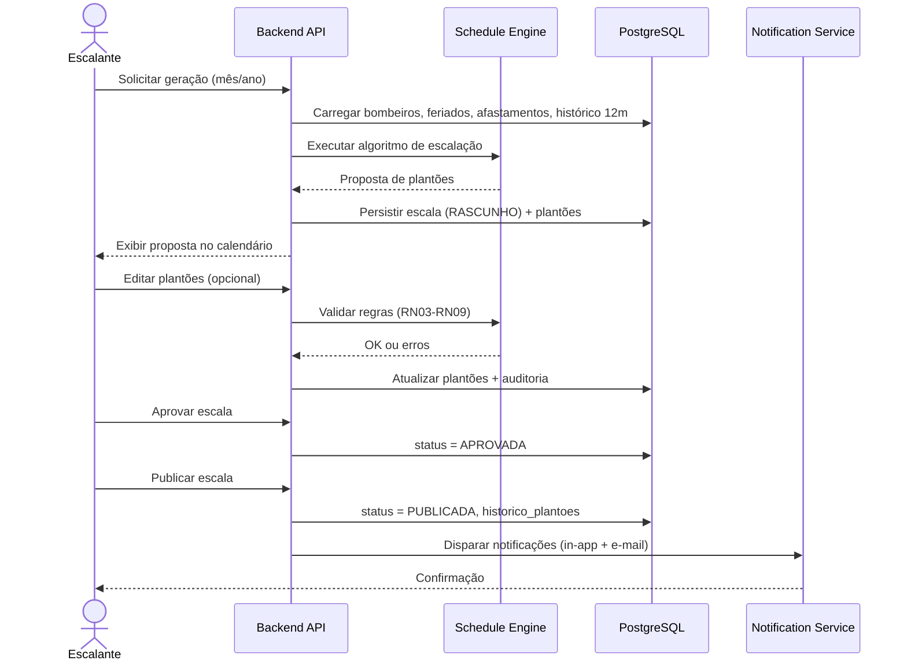
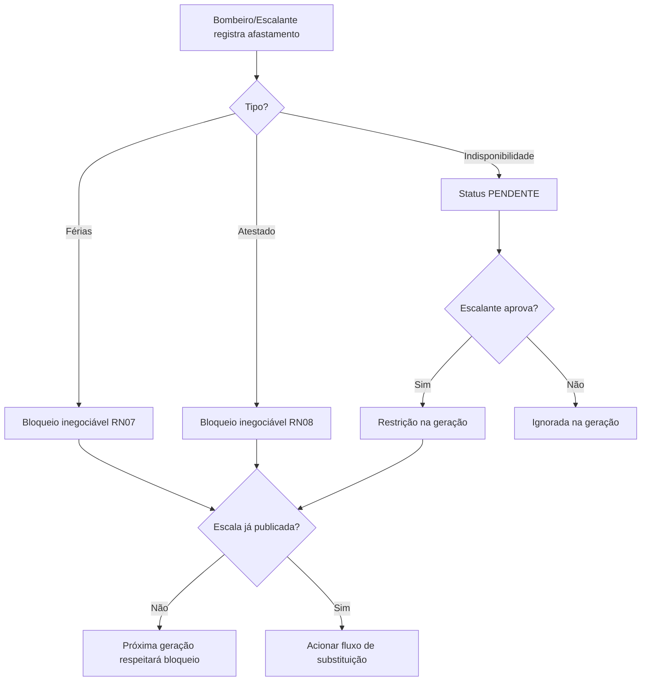
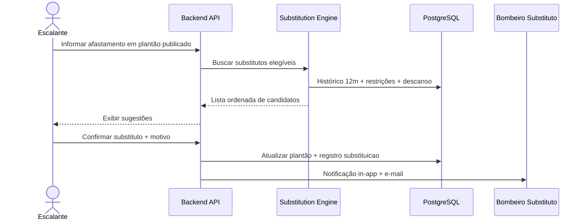
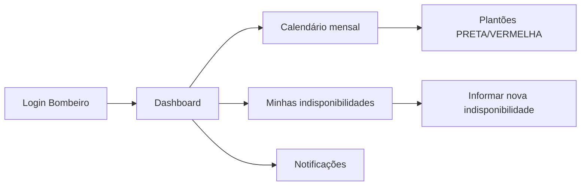

# Sistema de Gerenciamento de Escalas — Corpo de Bombeiros

**Versão:** 1.0  
**Data:** 06/08/2026  
**Papel:** Análise de Sistemas e Arquitetura de Software  

---

## Visão Geral

Aplicação web para gerenciamento de escalas de plantão de um Corpo de Bombeiros composto por **12 bombeiros** e **1 escalante administrador**. O sistema automatiza a distribuição justa de plantões, respeita restrições legais e operacionais, permite aprovação humana antes da publicação e notifica alterações relevantes.

### Premissas adotadas

| Item | Premissa |
|------|----------|
| Período da escala | Mensal (01 a último dia do mês) |
| Unidade operacional | Uma única guarnição/unidade |
| Plantão | 24 horas, das 08:00 às 08:00 do dia seguinte |
| Tipos de escala | **PRETA** (dias úteis) e **VERMELHA** (sábados, domingos e feriados) |
| Feriados | Cadastro configurável pelo escalante (nacionais, estaduais e locais) |
| Idioma | Português (Brasil) |
| Fuso horário | America/Sao_Paulo |

---

## 1. Requisitos Funcionais

### RF01 — Autenticação e Autorização
- O sistema deve permitir login com e-mail e senha.
- Deve existir controle de acesso baseado em papéis: **Escalante (Administrador)** e **Bombeiro**.
- O escalante gerencia usuários, feriados e escalas; o bombeiro consulta escala e registra indisponibilidades.

### RF02 — Cadastro de Bombeiros
- O escalante deve cadastrar, editar e desativar bombeiros (nome, e-mail, matrícula, telefone, data de admissão, status ativo/inativo).
- Bombeiro inativo não participa da geração automática de escalas.

### RF03 — Cadastro de Feriados
- O escalante deve cadastrar feriados com data, descrição e tipo (nacional, estadual, local).
- Feriados cadastrados classificam o plantão como escala **VERMELHA**.

### RF04 — Registro de Férias
- O escalante (ou bombeiro, conforme política interna) deve registrar períodos de férias com data início e fim.
- Férias são **obrigatórias e inegociáveis**: o bombeiro não pode ser escalado nesses dias.

### RF05 — Registro de Atestados Médicos
- Deve ser possível registrar atestados com data início, fim, observação e comprovante (upload opcional).
- Atestados são **obrigatórios e inegociáveis**: bloqueiam escalação no período.

### RF06 — Indisponibilidades e Justificativas
- Bombeiros devem informar indisponibilidades futuras com data(s), motivo e justificativa textual.
- Indisponibilidades entram como restrição na geração da escala (não substituem férias/atestados, mas complementam a visibilidade operacional).
- O escalante pode visualizar, aprovar ou rejeitar indisponibilidades, conforme política interna.

### RF07 — Geração Automática de Escala
- O sistema deve gerar proposta de escala mensal considerando:
  - Apenas **1 bombeiro por plantão**.
  - Descanso mínimo de **24h após o término** do plantão (próximo plantão só após 08:00 do segundo dia seguinte ao início).
  - Bloqueios por férias, atestados e indisponibilidades aprovadas.
  - Distribuição justa de plantões **PRETA** e **VERMELHA**.
  - Diferença máxima de **3 plantões** (total ou por tipo — ver RN05) entre bombeiros ativos.
  - Histórico dos **últimos 12 meses** para equilibrar finais de semana e feriados.

### RF08 — Edição Manual pela Escalante
- Após a geração automática, o escalante pode ajustar manualmente a proposta (trocar bombeiro de um plantão).
- Toda alteração manual deve validar regras de negócio em tempo real e registrar log de auditoria.

### RF09 — Aprovação e Publicação
- A escala permanece em status **Rascunho** até aprovação do escalante.
- Após aprovação, a escala é **publicada** e fica visível a todos os bombeiros.
- Escalas publicadas só podem ser alteradas mediante nova versão/republicação com notificação.

### RF10 — Sugestão de Substitutos
- Diante de afastamento (atestado, férias emergenciais ou indisponibilidade) em plantão já publicado, o sistema deve sugerir substitutos elegíveis ordenados por critério de justiça.
- O escalante confirma ou escolhe outro substituto manualmente.

### RF11 — Consulta de Escala
- Bombeiros visualizam escala publicada em visão mensal/calendário e lista.
- Destaque visual para plantões PRETA e VERMELHA.
- Escalante visualiza rascunho, publicada e histórico.

### RF12 — Relatórios e Indicadores
- Relatório de plantões por bombeiro (mês atual e acumulado 12 meses).
- Relatório de equilíbrio PRETA vs VERMELHA.
- Relatório de violações evitadas e exceções aprovadas manualmente.

### RF13 — Notificações
- Notificações internas (in-app) para: publicação de escala, alteração de plantão, sugestão de substituição pendente.
- E-mail para eventos importantes: escala publicada, plantão alterado, convocação como substituto.

### RF14 — Auditoria
- Registrar quem fez o quê e quando: geração, edição, aprovação, publicação, substituições.

---

## 2. Requisitos Não Funcionais

### RNF01 — Disponibilidade
- Disponibilidade mínima de **99,5%** em horário comercial; acesso 24/7 para consulta de escala publicada.

### RNF02 — Performance
- Geração de escala mensal (31 plantões) em até **5 segundos**.
- Carregamento de calendário mensal em até **2 segundos**.

### RNF03 — Segurança
- Senhas com hash bcrypt/argon2.
- HTTPS obrigatório em produção.
- Controle de sessão com expiração por inatividade.
- RBAC (Role-Based Access Control).
- Proteção contra CSRF, XSS e SQL Injection.

### RNF04 — Usabilidade
- Interface responsiva (desktop e tablet).
- Calendário visual intuitivo com cores PRETA/VERMELHA.
- Mensagens de erro claras quando regra de negócio for violada.

### RNF05 — Confiabilidade
- Transações atômicas na publicação e substituição de plantões.
- Backup diário do banco de dados.

### RNF06 — Manutenibilidade
- Código modular com separação clara entre domínio, aplicação e infraestrutura.
- Logs estruturados para troubleshooting.

### RNF07 — Escalabilidade
- Arquitetura preparada para crescimento futuro (mais guarnições), mesmo operando inicialmente com 1 unidade e 12 bombeiros.

### RNF08 — Conformidade
- Registro de consentimento para envio de e-mail.
- Retenção de histórico de escalas por no mínimo **5 anos** (ajustável).

### RNF09 — Testabilidade
- Regras de negócio (motor de escalação) isoladas e cobertas por testes automatizados.

### RNF10 — Implantação
- Containerização com Docker para ambientes de desenvolvimento, homologação e produção.

---

## 3. Casos de Uso

### Atores
- **Escalante (Administrador)**
- **Bombeiro**
- **Sistema** (processos automáticos: geração, notificação, validação)

| ID | Caso de Uso | Ator Principal | Descrição |
|----|-------------|----------------|-----------|
| UC01 | Autenticar no sistema | Escalante / Bombeiro | Login seguro com redirecionamento por perfil |
| UC02 | Gerenciar bombeiros | Escalante | CRUD de bombeiros e ativação/desativação |
| UC03 | Gerenciar feriados | Escalante | Manter calendário de feriados |
| UC04 | Registrar férias | Escalante | Cadastrar períodos de férias obrigatórios |
| UC05 | Registrar atestado | Escalante / Bombeiro | Informar afastamento médico com período |
| UC06 | Informar indisponibilidade | Bombeiro | Declarar datas indisponíveis com justificativa |
| UC07 | Avaliar indisponibilidade | Escalante | Aprovar ou rejeitar indisponibilidade informada |
| UC08 | Gerar escala mensal | Escalante | Solicitar proposta automática para o mês |
| UC09 | Editar escala (rascunho) | Escalante | Ajustar manualmente plantões da proposta |
| UC10 | Aprovar e publicar escala | Escalante | Validar e tornar escala oficial |
| UC11 | Consultar escala | Bombeiro / Escalante | Visualizar calendário e detalhes |
| UC12 | Solicitar substituto | Escalante | Ante afastamento, obter sugestões e confirmar |
| UC13 | Receber notificações | Bombeiro / Escalante | In-app e e-mail |
| UC14 | Consultar relatórios | Escalante | Indicadores de equilíbrio e histórico |
| UC15 | Consultar auditoria | Escalante | Trilha de alterações |

### Diagrama de casos de uso (resumo)

```
                    ┌─────────────────────────────────────┐
                    │     Sistema de Escalas Bombeiros   │
                    └─────────────────────────────────────┘
         ┌────────────────┬────────────────┬──────────────────┐
         │                │                │                  │
    [Escalante]       [Bombeiro]        [Sistema]         (E-mail)
         │                │                │
    UC02-UC04, UC07   UC05, UC06, UC11   UC08, UC13
    UC08-UC10, UC12   UC13              (automático)
    UC13-UC15
```

---

## 4. Regras de Negócio

### RN01 — Composição do Plantão
- Cada plantão possui **exatamente 1 bombeiro** escalado.

### RN02 — Horário e Duração
- Plantão inicia às **08:00** e encerra às **08:00** do dia seguinte (24 horas).

### RN03 — Descanso Mínimo
- Após o término de um plantão (08:00), o bombeiro só pode iniciar novo plantão após **24 horas completas de descanso**, ou seja, a partir das **08:00 do segundo dia** seguinte ao início do plantão anterior.

**Exemplo:** Plantão seg 08:00 → ter 08:00. Descanso até qua 08:00. Próximo plantão permitido: qua 08:00 em diante.

### RN04 — Classificação PRETA / VERMELHA
| Tipo | Condição |
|------|----------|
| **PRETA** | Segunda a sexta, exceto feriados |
| **VERMELHA** | Sábado, domingo ou feriado cadastrado |

### RN05 — Equidade na Distribuição
- Em uma escala mensal gerada, a diferença entre o bombeiro com **mais plantões** e o com **menos plantões** não pode exceder **3**, considerando:
  - **Total geral** de plantões no mês; e
  - **Subtotais** por tipo (PRETA e VERMELHA) separadamente.
- Se impossível satisfazer todas as restrições, o sistema prioriza: (1) férias/atestados, (2) descanso, (3) equidade VERMELHA com histórico 12 meses, (4) equidade total.

### RN06 — Histórico de 12 Meses (VERMELHA)
- Na geração, bombeiros com **menor quantidade acumulada** de plantões VERMELHA nos últimos 12 meses têm **prioridade** para novos plantões VERMELHA.
- Empate: menor total geral de plantões no período; persistindo, ordem rotativa por matrícula.

### RN07 — Férias (Inegociável)
- Bombeiro em férias **não pode** ser alocado em plantão no período.
- Férias registradas bloqueiam geração automática e edição manual (exceto override explícito do escalante com justificativa auditada — uso excepcional).

### RN08 — Atestados (Inegociável)
- Mesmo comportamento das férias: bloqueio total no período do atestado.

### RN09 — Indisponibilidades
- Indisponibilidade **aprovada** funciona como restrição na geração.
- Indisponibilidade **pendente** alerta o escalante, mas não bloqueia automaticamente (configurável; padrão: bloqueia após aprovação).

### RN10 — Ciclo de Vida da Escala

| Status | Descrição |
|--------|-----------|
| `RASCUNHO` | Proposta gerada ou em edição |
| `APROVADA` | Validada pelo escalante, aguardando publicação |
| `PUBLICADA` | Oficial, visível aos bombeiros |
| `ARQUIVADA` | Mês encerrado, somente consulta |

### RN11 — Substituição
- Substituto deve: (a) não estar em férias/atestado/indisponível; (b) respeitar RN03; (c) maximizar equidade.
- Ordenação de sugestão: menor carga VERMELHA (12 meses) → menor carga total no mês → maior tempo sem plantão.

### RN12 — Publicação e Alterações
- Escala publicada alterada gera **notificação obrigatória** ao bombeiro afetado (in-app + e-mail).
- Alteração em plantão VERMELHA publicado registra motivo obrigatório.

### RN13 — Bombeiros Ativos
- Apenas bombeiros com status **ATIVO** entram na rotação.
- Mínimo de 1 bombeiro elegível por dia; se impossível, sistema alerta escalante ( déficit de pessoal).

### RN14 — Feriado vs Dia da Semana
- Feriado em dia útil → plantão **VERMELHA** (prevalece sobre PRETA).

---

## 5. Arquitetura da Solução

### 5.1 Estilo Arquitetural
**Monólito modular** com frontend SPA e backend API REST — adequado ao porte inicial (13 usuários), simplifica implantação e manutenção, mantendo fronteiras claras para evolução futura.

### 5.2 Diagrama de Contexto

```
┌──────────────┐         HTTPS          ┌──────────────────────────────┐
│   Browser    │ ◄────────────────────► │   API Backend (Monólito)      │
│  (React SPA) │                        │   - Auth / RBAC               │
└──────────────┘                        │   - Domínio Escalas           │
                                        │   - Motor de Equidade         │
                                        │   - Notificações              │
                                        └───────────┬──────────────────┘
                                                    │
                    ┌───────────────────────────────┼───────────────────────┐
                    │                               │                       │
              ┌─────▼─────┐                  ┌──────▼──────┐         ┌──────▼──────┐
              │ PostgreSQL │                  │   Redis     │         │  SMTP /     │
              │ (dados)    │                  │ (cache/jobs)│         │  SendGrid   │
              └───────────┘                  └─────────────┘         └─────────────┘
```

### 5.3 Camadas (Backend)

| Camada | Responsabilidade |
|--------|------------------|
| **Apresentação (API)** | Controllers REST, DTOs, validação de entrada |
| **Aplicação** | Casos de uso, orquestração, transações |
| **Domínio** | Entidades, regras de negócio, motor de escalação |
| **Infraestrutura** | ORM, repositórios, e-mail, filas, arquivos |

### 5.4 Stack Tecnológica Proposta

| Camada | Tecnologia |
|--------|------------|
| Frontend | React + TypeScript + Vite |
| UI | Tailwind CSS + componentes calendário (FullCalendar ou similar) |
| Backend | Node.js + NestJS (ou FastAPI/Python — equivalente) |
| Banco | PostgreSQL 16 |
| Cache/Fila | Redis + BullMQ (jobs de e-mail e geração pesada) |
| Auth | JWT + refresh token |
| Container | Docker + Docker Compose |
| E-mail | SMTP institucional ou SendGrid |

### 5.5 Componentes Principais

1. **Auth Service** — login, perfis, sessão.
2. **Cadastro Service** — bombeiros, feriados.
3. **Afastamento Service** — férias, atestados, indisponibilidades.
4. **Schedule Engine** — algoritmo de geração e validação (core).
5. **Substitution Engine** — ranking de substitutos.
6. **Notification Service** — in-app + e-mail assíncrono.
7. **Audit Service** — trilha de auditoria append-only.

### 5.6 Motor de Escalação (visão algorítmica)

```
ENTRADA: mês alvo, bombeiros ativos, restrições, histórico 12 meses
PARA cada dia D do mês:
  tipo ← PRETA ou VERMELHA (RN04)
  candidatos ← bombeiros elegíveis (RN07-RN09, RN03)
  ordenar candidatos por score de equidade (RN05, RN06)
  atribuir melhor candidato
  atualizar contadores temporários
VALIDAR diferença máxima 3 (RN05)
SE inválido → backtrack/heurística de swap ou alertar escalante
SAÍDA: proposta RASCUNHO
```

---

## 6. Modelagem do Banco de Dados

### 6.1 Diagrama Entidade-Relacionamento (conceitual)

```
┌─────────────┐       ┌──────────────┐       ┌─────────────┐
│   USUARIO   │───────│   BOMBEIRO   │       │   FERIADO   │
└─────────────┘       └──────────────┘       └─────────────┘
       │                      │
       │               ┌──────┴──────┬──────────────┬──────────────┐
       │               │             │              │              │
       │          ┌────▼────┐  ┌─────▼─────┐  ┌─────▼─────┐  ┌────▼────┐
       │          │  FERIAS │  │ ATESTADO  │  │INDISPONIB.│  │ ESCALA  │
       │          └─────────┘  └───────────┘  └───────────┘  └────┬────┘
       │                                                            │
       │                                                      ┌─────▼─────┐
       └──────────────────────────────────────────────────────│ PLANTAO   │
                                                              └───────────┘
┌─────────────┐  ┌──────────────┐  ┌─────────────────┐
│ NOTIFICACAO │  │ AUDITORIA    │  │ HIST_PLANTAO    │
└─────────────┘  └──────────────┘  └─────────────────┘
```

### 6.2 Tabelas e Campos

#### `usuarios`
| Campo | Tipo | Observação |
|-------|------|------------|
| id | UUID PK | |
| email | VARCHAR(255) UNIQUE | |
| senha_hash | VARCHAR(255) | |
| papel | ENUM('ESCALANTE','BOMBEIRO') | |
| ativo | BOOLEAN | |
| created_at | TIMESTAMP | |
| updated_at | TIMESTAMP | |

#### `bombeiros`
| Campo | Tipo | Observação |
|-------|------|------------|
| id | UUID PK | |
| usuario_id | UUID FK → usuarios | |
| matricula | VARCHAR(20) UNIQUE | |
| nome_completo | VARCHAR(150) | |
| telefone | VARCHAR(20) | |
| data_admissao | DATE | |
| status | ENUM('ATIVO','INATIVO') | |
| created_at | TIMESTAMP | |

#### `feriados`
| Campo | Tipo | Observação |
|-------|------|------------|
| id | UUID PK | |
| data | DATE UNIQUE | |
| descricao | VARCHAR(100) | |
| tipo | ENUM('NACIONAL','ESTADUAL','LOCAL') | |
| created_at | TIMESTAMP | |

#### `ferias`
| Campo | Tipo | Observação |
|-------|------|------------|
| id | UUID PK | |
| bombeiro_id | UUID FK | |
| data_inicio | DATE | |
| data_fim | DATE | |
| observacao | TEXT | |
| created_at | TIMESTAMP | |

#### `atestados`
| Campo | Tipo | Observação |
|-------|------|------------|
| id | UUID PK | |
| bombeiro_id | UUID FK | |
| data_inicio | DATE | |
| data_fim | DATE | |
| observacao | TEXT | |
| arquivo_url | VARCHAR(500) NULL | |
| created_at | TIMESTAMP | |

#### `indisponibilidades`
| Campo | Tipo | Observação |
|-------|------|------------|
| id | UUID PK | |
| bombeiro_id | UUID FK | |
| data_inicio | DATE | |
| data_fim | DATE | |
| motivo | VARCHAR(100) | |
| justificativa | TEXT | |
| status | ENUM('PENDENTE','APROVADA','REJEITADA') | |
| avaliado_por | UUID FK → usuarios NULL | |
| created_at | TIMESTAMP | |

#### `escalas`
| Campo | Tipo | Observação |
|-------|------|------------|
| id | UUID PK | |
| ano | SMALLINT | |
| mes | SMALLINT | CHECK 1-12 |
| status | ENUM('RASCUNHO','APROVADA','PUBLICADA','ARQUIVADA') | |
| gerada_em | TIMESTAMP | |
| aprovada_por | UUID FK → usuarios NULL | |
| aprovada_em | TIMESTAMP NULL | |
| publicada_em | TIMESTAMP NULL | |
| versao | INTEGER DEFAULT 1 | |

#### `plantoes`
| Campo | Tipo | Observação |
|-------|------|------------|
| id | UUID PK | |
| escala_id | UUID FK | |
| bombeiro_id | UUID FK | |
| data_inicio | TIMESTAMP | Sempre 08:00 |
| data_fim | TIMESTAMP | +24h |
| tipo | ENUM('PRETA','VERMELHA') | |
| origem | ENUM('AUTOMATICA','MANUAL','SUBSTITUICAO') | |
| observacao | TEXT NULL | |
| UNIQUE(escala_id, data_inicio) | | 1 bombeiro/dia |

#### `substituicoes`
| Campo | Tipo | Observação |
|-------|------|------------|
| id | UUID PK | |
| plantao_id | UUID FK | |
| bombeiro_original_id | UUID FK | |
| bombeiro_substituto_id | UUID FK | |
| motivo | TEXT | |
| confirmada_por | UUID FK → usuarios | |
| confirmada_em | TIMESTAMP | |

#### `notificacoes`
| Campo | Tipo | Observação |
|-------|------|------------|
| id | UUID PK | |
| usuario_id | UUID FK | |
| tipo | VARCHAR(50) | |
| titulo | VARCHAR(150) | |
| mensagem | TEXT | |
| lida | BOOLEAN DEFAULT false | |
| created_at | TIMESTAMP | |

#### `auditoria`
| Campo | Tipo | Observação |
|-------|------|------------|
| id | UUID PK | |
| usuario_id | UUID FK NULL | |
| entidade | VARCHAR(50) | |
| entidade_id | UUID | |
| acao | VARCHAR(50) | |
| payload_antes | JSONB NULL | |
| payload_depois | JSONB NULL | |
| created_at | TIMESTAMP | |

#### `historico_plantoes` (desnormalizado para consulta rápida 12 meses)
| Campo | Tipo | Observação |
|-------|------|------------|
| id | UUID PK | |
| bombeiro_id | UUID FK | |
| plantao_id | UUID FK | |
| data | DATE | |
| tipo | ENUM('PRETA','VERMELHA') | |
| ano_mes | CHAR(7) | Ex: 2026-08 |

> **Índices recomendados:** `(bombeiro_id, data)`, `(escala_id)`, `(historico_plantoes.bombeiro_id, tipo, data)`, `(ferias.data_inicio, data_fim)`.

---

## 7. Estrutura de Pastas

```
escala-bombeiros/
├── docker-compose.yml
├── docker-compose.prod.yml
├── .env.example
├── README.md
├── docs/
│   ├── DOCUMENTACAO.md          # Este documento
│   ├── API.md                   # Contratos REST (futuro)
│   └── FLUXOS.md                # Diagramas detalhados (futuro)
│
├── backend/
│   ├── Dockerfile
│   ├── package.json
│   ├── tsconfig.json
│   ├── prisma/                  # ou migrations/
│   │   ├── schema.prisma
│   │   └── migrations/
│   └── src/
│       ├── main.ts
│       ├── app.module.ts
│       ├── config/
│       ├── common/              # guards, filters, pipes
│       ├── modules/
│       │   ├── auth/
│       │   ├── usuarios/
│       │   ├── bombeiros/
│       │   ├── feriados/
│       │   ├── afastamentos/    # ferias, atestados, indisponibilidades
│       │   ├── escalas/
│       │   │   ├── schedule-engine/   # motor de geração
│       │   │   └── substitution-engine/
│       │   ├── notificacoes/
│       │   └── auditoria/
│       └── shared/
│
├── frontend/
│   ├── Dockerfile
│   ├── package.json
│   ├── vite.config.ts
│   ├── index.html
│   └── src/
│       ├── main.tsx
│       ├── App.tsx
│       ├── api/                 # client HTTP
│       ├── auth/
│       ├── components/
│       │   ├── calendar/
│       │   ├── layout/
│       │   └── ui/
│       ├── pages/
│       │   ├── Login/
│       │   ├── Dashboard/
│       │   ├── Escala/
│       │   ├── Bombeiros/
│       │   ├── Afastamentos/
│       │   └── Relatorios/
│       ├── hooks/
│       ├── stores/              # estado global
│       ├── types/
│       └── utils/
│
└── scripts/
    ├── seed.ts                  # dados iniciais (12 bombeiros)
    └── backup-db.sh
```

---

## 8. Fluxos do Sistema

### 8.1 Fluxo — Geração e Publicação da Escala



### 8.2 Fluxo — Registro de Afastamento e Impacto



### 8.3 Fluxo — Sugestão de Substituto



### 8.4 Fluxo — Consulta do Bombeiro



### 8.5 Fluxo — Validação de Descanso (RN03)

```
Plantão A: início Da 08:00 → fim Db 08:00
Descanso mínimo: 24h após fim → até Dc 08:00
Plantão B permitido: início >= Dc 08:00

Linha do tempo:
Da 08:00 ─────────────── Db 08:00 ── descanso 24h ── Dc 08:00 ✓ próximo OK
```

### 8.6 Fluxo — Notificações

| Evento | In-App | E-mail |
|--------|--------|--------|
| Escala publicada | Todos os bombeiros | Sim |
| Plantão alterado após publicação | Bombeiro afetado | Sim |
| Convocação como substituto | Substituto | Sim |
| Indisponibilidade aprovada/rejeitada | Bombeiro solicitante | Opcional |
| Falha na geração (déficit) | Escalante | Sim |

---

## Glossário

| Termo | Definição |
|-------|-----------|
| **Plantão** | Turno de 24h das 08:00 às 08:00 |
| **Escala PRETA** | Plantão em dia útil (não feriado) |
| **Escala VERMELHA** | Plantão em fim de semana ou feriado |
| **Escalante** | Administrador responsável pela escala |
| **Motor de escalação** | Componente que aplica regras e gera distribuição |

---

## Próximos Passos (fora deste documento)

1. Validar premissas com stakeholders (período mensal, fluxo de indisponibilidades).
2. Prototipar UI do calendário.
3. Implementar MVP: auth, cadastros, motor de escalação, publicação.
4. Testes unitários do Schedule Engine com cenários de borda.
5. Homologação com escalante real usando dados simulados.
