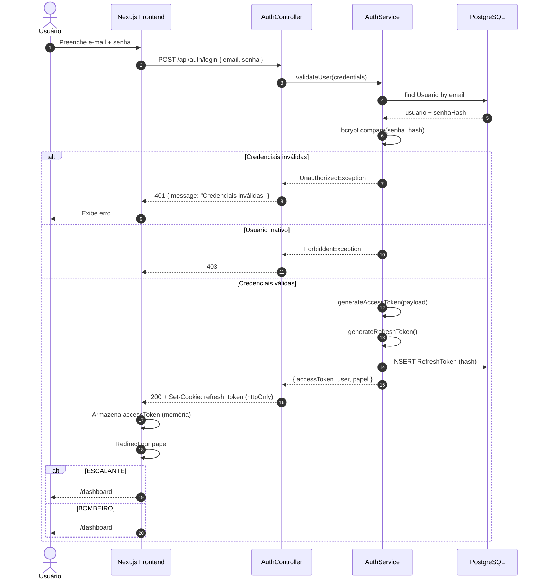
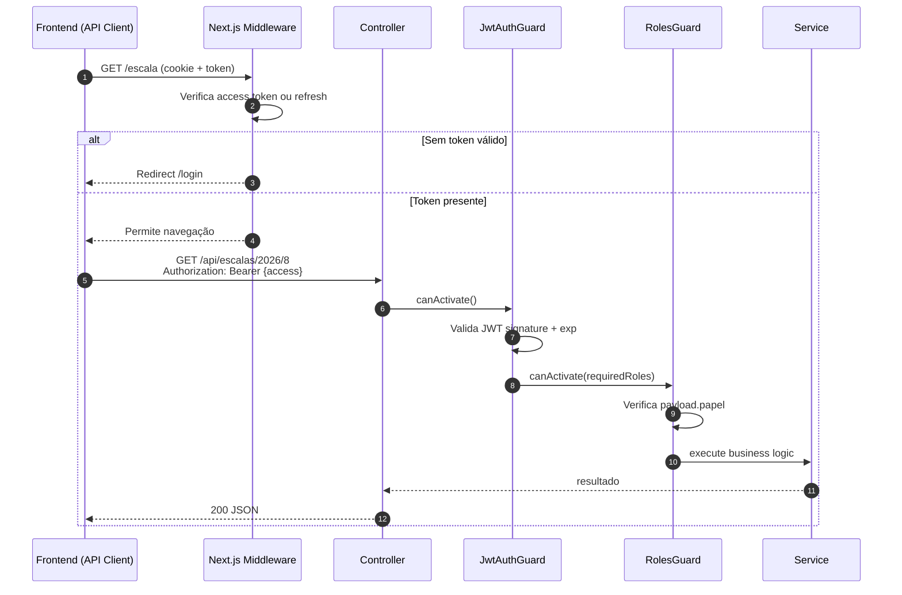
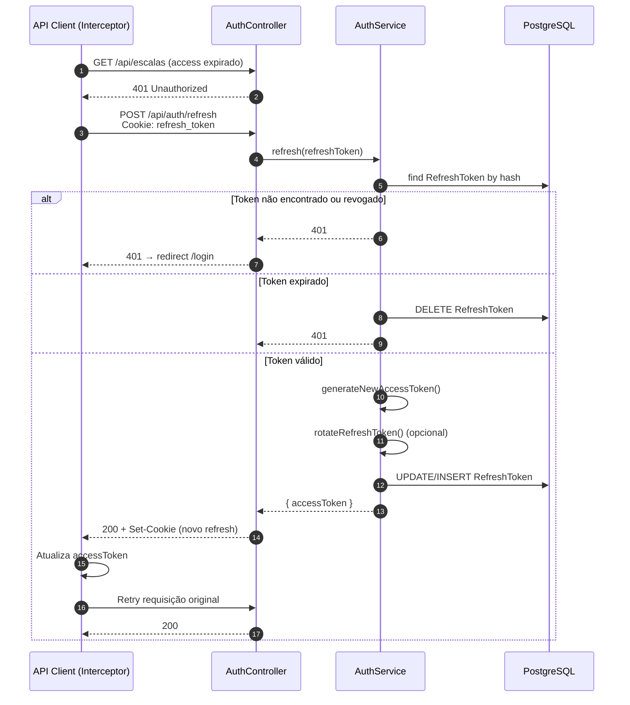
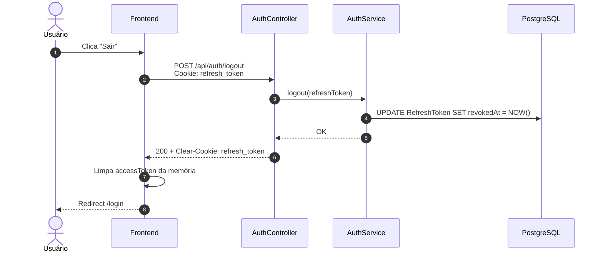
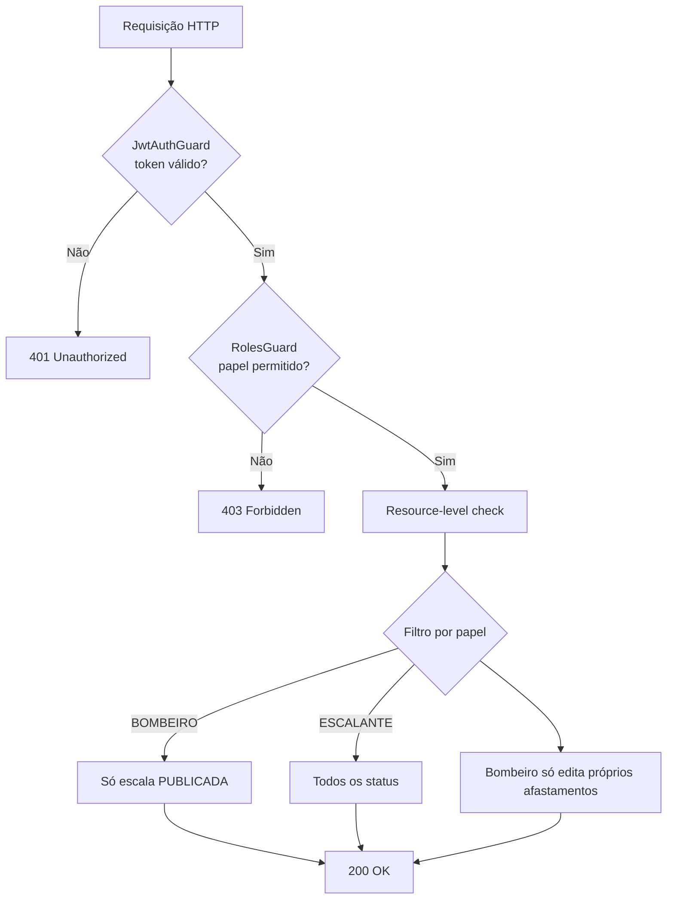
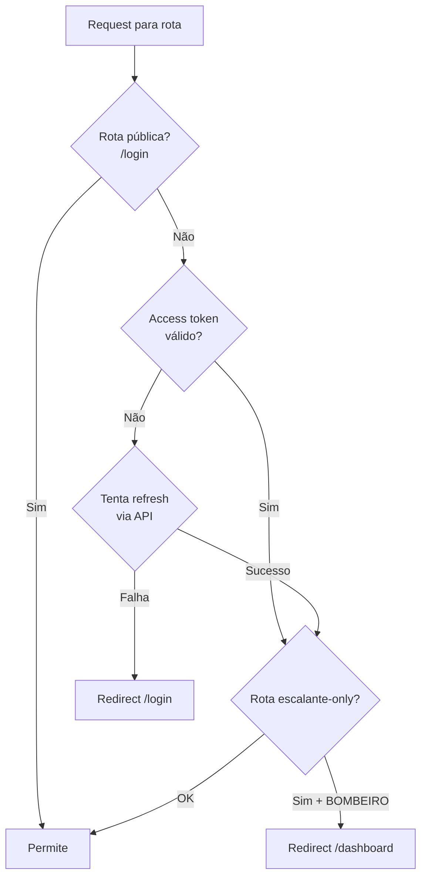

# Fluxo de Autenticação JWT

**Versão:** 1.0  
**Módulos:** AuthModule, UsuariosModule  
**Frontend:** middleware.ts, lib/auth  

---

## 1. Visão Geral

Autenticação baseada em **JWT dual-token**:

| Token | Duração | Armazenamento | Uso |
|-------|---------|---------------|-----|
| **Access Token** | 15 minutos | Memória (Zustand) ou cookie não-httpOnly | Header `Authorization: Bearer` |
| **Refresh Token** | 7 dias | Cookie `httpOnly`, `Secure`, `SameSite=Strict` | Renovação silenciosa |

Refresh tokens são persistidos em `RefreshToken` (hash) para permitir revogação no logout.

---

## 2. Participantes

| Participante | Papel |
|--------------|-------|
| **Browser (Next.js)** | UI, middleware, API client |
| **AuthController** | Endpoints `/auth/*` |
| **AuthService** | Lógica login, refresh, logout |
| **JwtStrategy** | Valida access token |
| **JwtRefreshStrategy** | Valida refresh token |
| **Prisma** | Usuario, RefreshToken |
| **RolesGuard** | Autorização por papel |

---

## 3. Fluxo de Login



### Payload do Access Token

```json
{
  "sub": "uuid-usuario",
  "email": "bombeiro@exemplo.com",
  "papel": "BOMBEIRO",
  "bombeiroId": "uuid-bombeiro",
  "iat": 1690000000,
  "exp": 1690000900
}
```

> Escalante não possui `bombeiroId` no payload.

---

## 4. Fluxo de Requisição Autenticada



---

## 5. Fluxo de Refresh Token



### Política de Rotação
- A cada refresh bem-sucedido, o refresh token anterior é **revogado** e um novo é emitido (previne replay).

---

## 6. Fluxo de Logout



---

## 7. Autorização por Papel (RBAC)



### Matriz de Endpoints Protegidos

| Endpoint | ESCALANTE | BOMBEIRO |
|----------|:---------:|:--------:|
| `POST /escalas/gerar` | ✓ | ✗ |
| `PATCH /escalas/:id/publicar` | ✓ | ✗ |
| `GET /escalas/:ano/:mes` | ✓ (todos status) | ✓ (PUBLICADA) |
| `POST /indisponibilidades` | ✓ | ✓ (próprio) |
| `PATCH /indisponibilidades/:id/aprovar` | ✓ | ✗ |
| `GET /auditoria` | ✓ | ✗ |

Implementação: decorator `@Roles(Papel.ESCALANTE)` + verificação adicional no service.

---

## 8. Proteção de Rotas — Frontend (Middleware)



**Rotas escalante-only no middleware:**
- `/bombeiros`, `/feriados`, `/escala/gerar`, `/substituicoes`, `/relatorios`, `/auditoria`

---

## 9. Tratamento de Erros

| Código | Situação | Ação Frontend |
|--------|----------|---------------|
| 401 | Token inválido/expirado | Tentar refresh → login |
| 403 | Papel insuficiente | Toast + redirect dashboard |
| 429 | Rate limit login | Mensagem "Aguarde 1 minuto" |

---

## 10. Segurança Complementar

| Medida | Detalhe |
|--------|---------|
| Rate limiting | 5 tentativas login/min/IP |
| Hash refresh | SHA-256 do token antes de persistir |
| Revogação em massa | Endpoint escalante revoga tokens de bombeiro desativado |
| HTTPS | Obrigatório em produção para cookies Secure |
| Payload mínimo | Sem dados sensíveis no JWT |

---

## 11. Endpoints Auth

| Método | Rota | Auth | Descrição |
|--------|------|------|-----------|
| POST | `/api/auth/login` | Público | Login |
| POST | `/api/auth/refresh` | Refresh cookie | Renovar access |
| POST | `/api/auth/logout` | Refresh cookie | Logout |
| GET | `/api/auth/me` | Bearer | Dados do usuário logado |

Ver também: [ARQUITETURA.md](./ARQUITETURA.md) · [MODULOS.md](./MODULOS.md)
