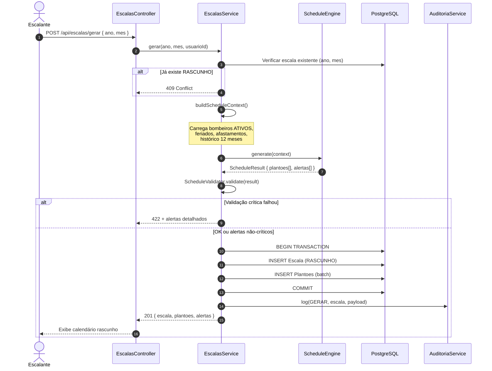
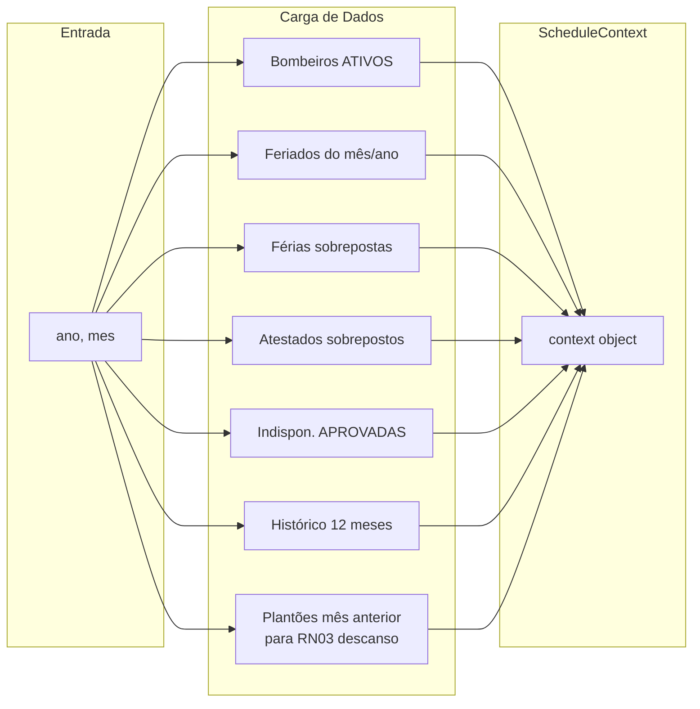
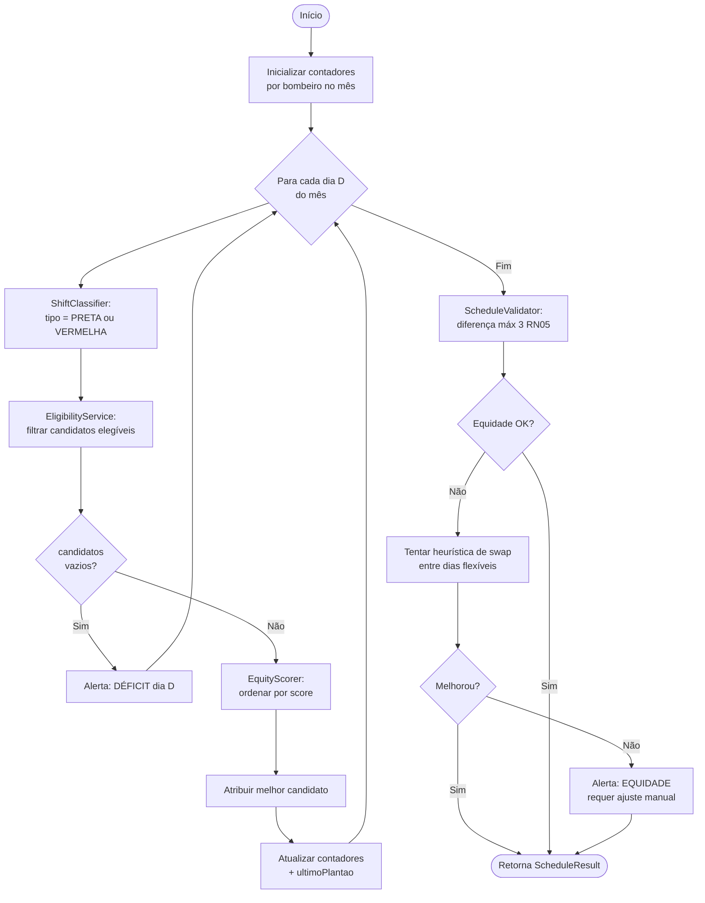
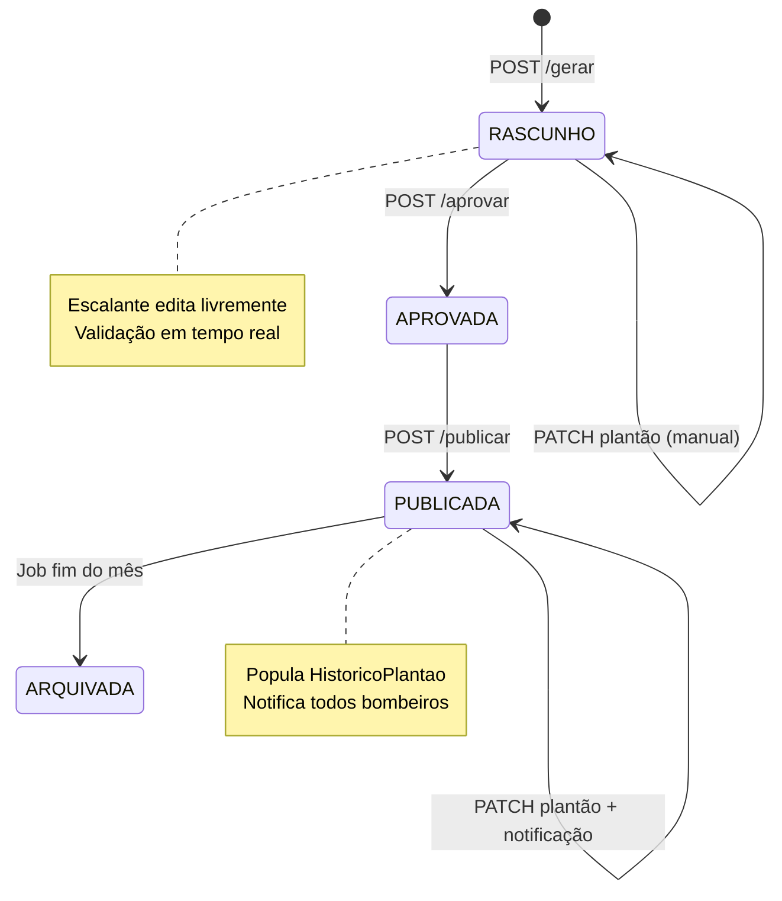
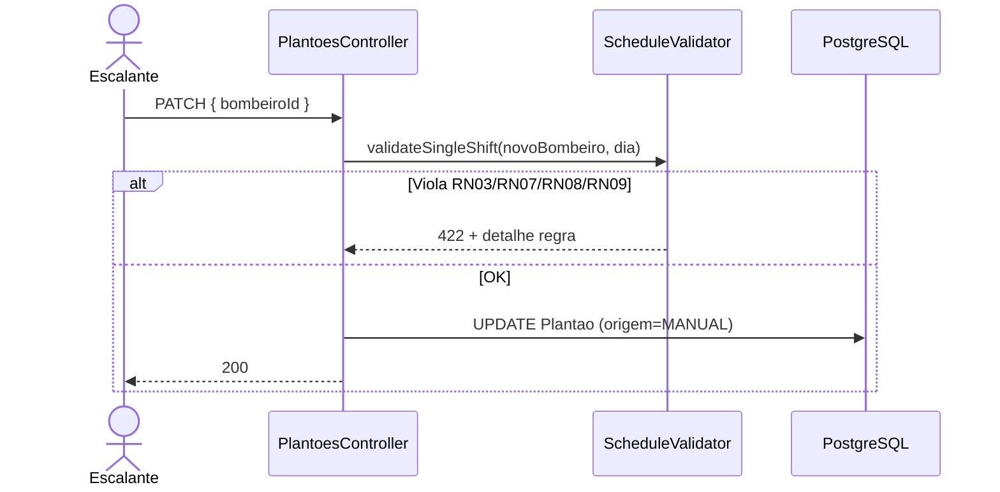
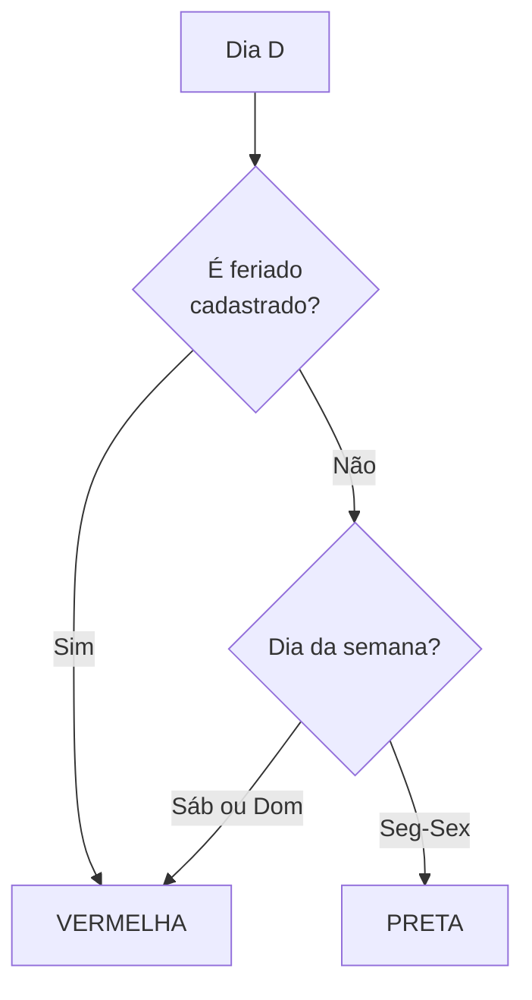

# Fluxo de Geração de Escalas

**Versão:** 1.0  
**Módulos:** EscalasModule, ScheduleEngineModule, AfastamentosModule, HistoricoModule, FeriadosModule  
**Regras:** RN01–RN06, RN13, RN14  

---

## 1. Visão Geral

O fluxo transforma dados operacionais (bombeiros, feriados, afastamentos, histórico) em uma **proposta de escala mensal** com status `RASCUNHO`, passando por validação de equidade e elegibilidade antes de persistência.

### Resultados possíveis

| Resultado | Descrição |
|-----------|-----------|
| **Sucesso total** | 31/31 plantões atribuídos, equidade OK |
| **Sucesso parcial** | Plantões atribuídos + alertas de equidade/déficit |
| **Falha** | Impossível cobrir todos os dias → alerta escalante |

---

## 2. Participantes

| Componente | Responsabilidade |
|------------|------------------|
| **EscalasController** | `POST /escalas/gerar` |
| **EscalasService** | Orquestração, transação Prisma |
| **ScheduleEngineService** | Algoritmo principal |
| **ShiftClassifierService** | PRETA vs VERMELHA (RN04, RN14) |
| **EligibilityService** | Quem pode trabalhar no dia (RN03, RN07–RN09, RN13) |
| **EquityScorerService** | Score de justiça (RN05, RN06) |
| **ScheduleValidatorService** | Validação final da proposta |
| **AfastamentosFacade** | Bloqueios unificados |
| **HistoricoService** | Plantões VERMELHA 12 meses |
| **AuditoriaService** | Log da geração |

---

## 3. Fluxo Principal



---

## 4. Construção do Contexto (`ScheduleContext`)



### Estrutura conceitual do contexto

| Campo | Tipo | Origem |
|-------|------|--------|
| `ano`, `mes` | number | Request |
| `dias` | Date[] | 1..último dia do mês |
| `bombeiros` | BombeiroAtivo[] | BombeirosModule |
| `feriados` | Set\<date\> | FeriadosModule |
| `bloqueios` | Map\<bombeiroId, DateRange[]\> | AfastamentosFacade |
| `historicoVermelha` | Map\<bombeiroId, number\> | HistoricoService |
| `historicoTotal` | Map\<bombeiroId, number\> | HistoricoService |
| `ultimoPlantao` | Map\<bombeiroId, Date\> | Plantões mês anterior + parcial |

---

## 5. Algoritmo de Geração (Schedule Engine)



---

## 6. Elegibilidade (`EligibilityService`)

Um bombeiro é **elegível** para o dia D se **todas** as condições forem verdadeiras:

| # | Condição | Regra |
|---|----------|-------|
| 1 | Status ATIVO | RN13 |
| 2 | Não está em férias no dia D | RN07 |
| 3 | Não possui atestado no dia D | RN08 |
| 4 | Indisponibilidade APROVADA não cobre D | RN09 |
| 5 | Descanso respeitado: `D >= ultimoPlantao + 48h` | RN03 |

### Cálculo de descanso (RN03)

```
Plantão anterior: início P_in (08:00) → fim P_fim (08:00+1d)
Próximo permitido: P_in + 2 dias às 08:00

Exemplo:
  Plantão seg 08:00 → próximo permitido qua 08:00
  Terça e quarta 00:00–07:59 = ainda em descanso se plantão seg→ter
```

---

## 7. Score de Equidade (`EquityScorerService`)

Score **menor = maior prioridade** (mais merece o plantão).

### Plantão VERMELHA (RN06)

```
score = (historicoVermelha12m * 1000)
      + (totalPlantoesMes * 10)
      + (historicoTotal12m * 1)
      + desempateMatricula
```

### Plantão PRETA

```
score = (totalPlantoesMes * 10)
      + (historicoTotal12m * 1)
      + desempateMatricula
```

### Penalidades dinâmicas (RN05)

Se atribuir plantão ao candidato violaria diferença > 3:
```
score += 10000  (penalidade alta — evitar)
```

---

## 8. Validação Final (`ScheduleValidatorService`)

| Validação | Tipo | Ação se falhar |
|-----------|------|----------------|
| 1 bombeiro/dia | Crítica | Rejeitar geração |
| Diferença total ≤ 3 | Alerta | Retornar com warning |
| Diferença PRETA ≤ 3 | Alerta | Retornar com warning |
| Diferença VERMELHA ≤ 3 | Alerta | Retornar com warning |
| Todos os dias cobertos | Crítica | Rejeitar + alerta déficit |
| Descanso em todos plantões | Crítica | Rejeitar |

---

## 9. Fluxo Pós-Geração (Edição → Aprovação → Publicação)



### Edição manual (`PATCH /plantoes/:id`)



---

## 10. Classificação PRETA / VERMELHA



---

## 11. Alertas Retornados ao Escalante

| Código | Severidade | Mensagem exemplo |
|--------|------------|------------------|
| `DEFICIT_DIA` | ERROR | "Dia 15/08: nenhum bombeiro elegível" |
| `EQUIDADE_TOTAL` | WARN | "Diferença de 4 plantões entre A e B" |
| `EQUIDADE_VERMELHA` | WARN | "Diferença VERMELHA de 4 entre C e D" |
| `SWAP_SUGERIDO` | INFO | "Trocar plantão dia 10 e 22 melhora equidade" |

Alertas ERROR impedem geração; WARN permitem rascunho com revisão manual.

---

## 12. Endpoints Relacionados

| Método | Rota | Descrição |
|--------|------|-----------|
| POST | `/api/escalas/gerar` | Gera rascunho |
| GET | `/api/escalas/:ano/:mes` | Consulta escala |
| PATCH | `/api/plantoes/:id` | Edição manual |
| POST | `/api/escalas/:id/aprovar` | Aprova |
| POST | `/api/escalas/:id/publicar` | Publica + histórico |
| GET | `/api/escalas/:id/equidade` | Resumo de equidade |

Ver também: [FLUXO-SUBSTITUICOES.md](./FLUXO-SUBSTITUICOES.md) · [FLUXO-NOTIFICACOES.md](./FLUXO-NOTIFICACOES.md)
