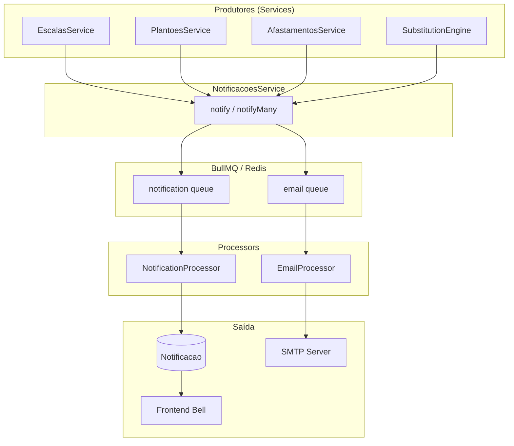
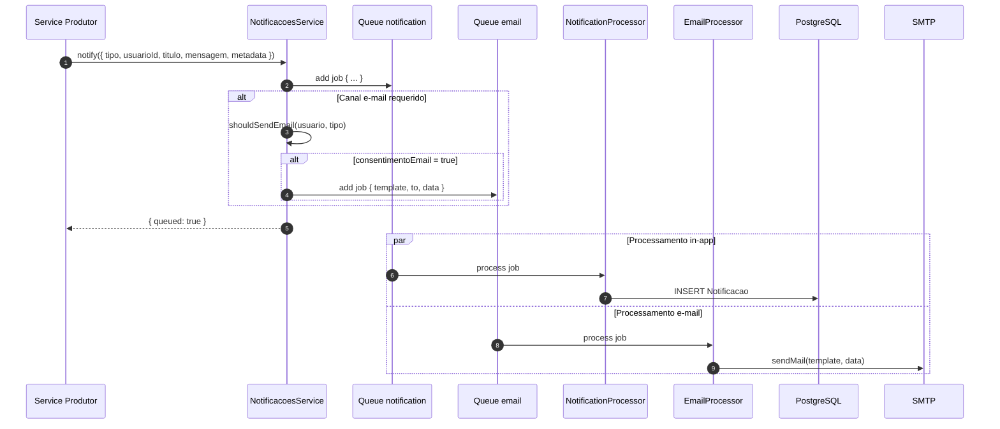
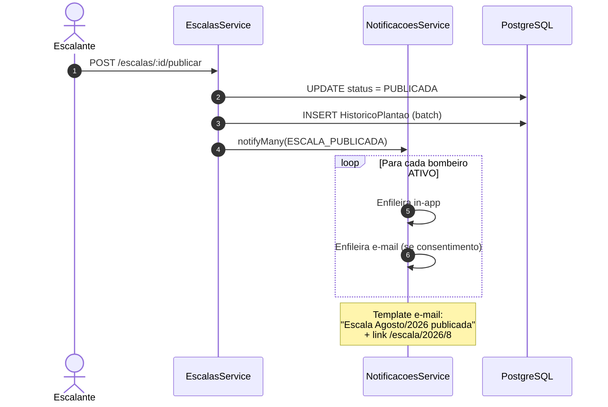
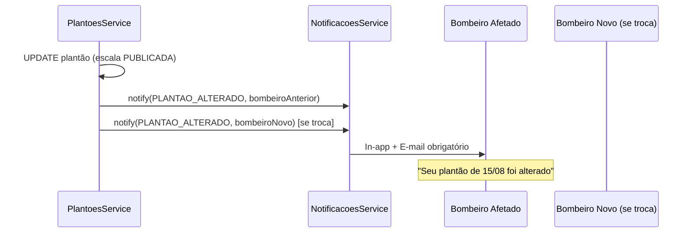
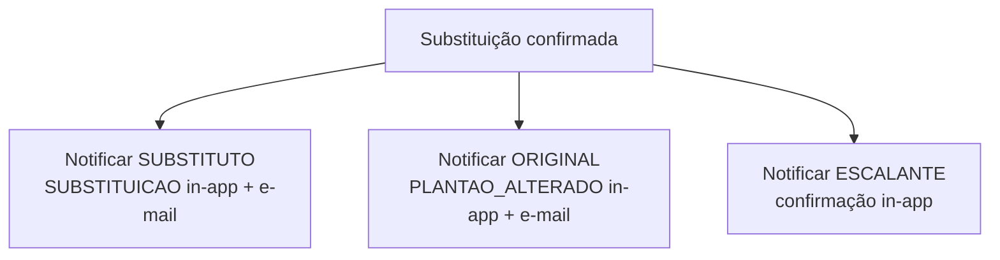
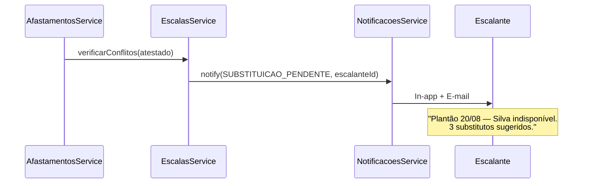
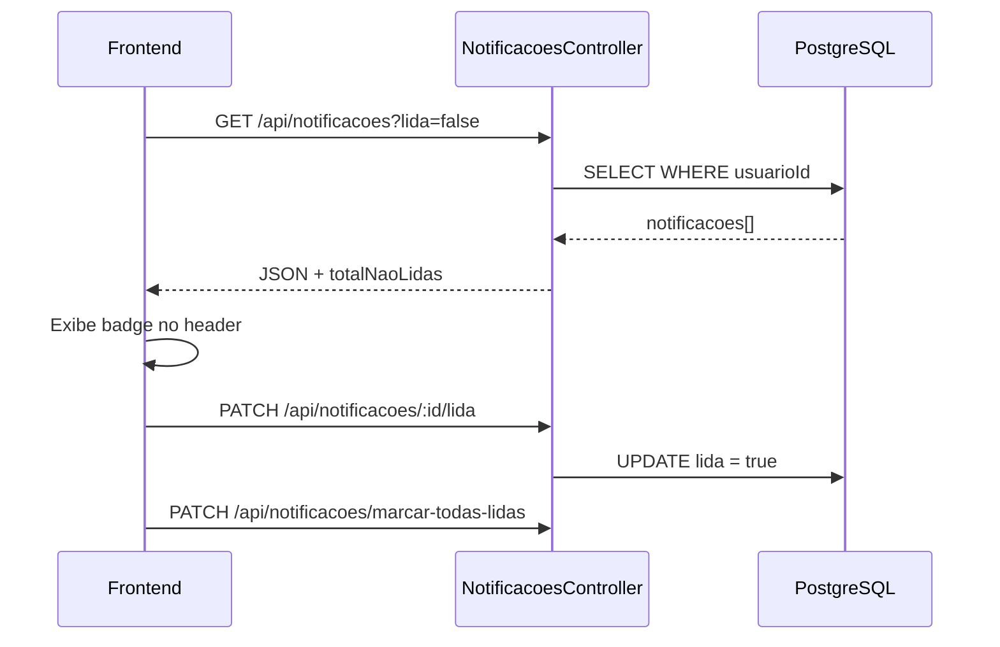
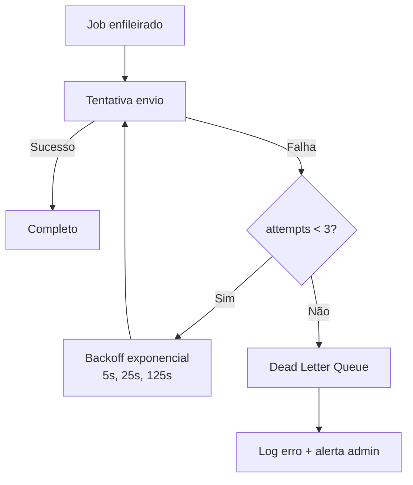

# Fluxo de Notificações

**Versão:** 1.0  
**Módulos:** NotificacoesModule, QueueModule, MailModule  
**Requisitos:** RF13, RN12  

---

## 1. Visão Geral

Sistema dual de notificações:

| Canal | Persistência | Uso |
|-------|--------------|-----|
| **In-app** | Tabela `Notificacao` | Todas as notificações |
| **E-mail** | Não persistido (log SMTP) | Eventos importantes + consentimento |

Processamento de e-mail **assíncrono** via BullMQ para não bloquear requisições HTTP.

---

## 2. Tipos de Notificação

| Tipo | Descrição | In-app | E-mail |
|------|-----------|:------:|:------:|
| `ESCALA_PUBLICADA` | Nova escala oficial do mês | Todos bombeiros | Sim |
| `PLANTAO_ALTERADO` | Plantão modificado pós-publicação | Bombeiro afetado | Sim |
| `SUBSTITUICAO` | Convocação como substituto | Substituto | Sim |
| `SUBSTITUICAO_PENDENTE` | Plantão precisa substituto | Escalante | Sim |
| `INDISPONIBILIDADE_AVALIADA` | Aprovação/rejeição | Solicitante | Opcional |
| `DEFICIT_ESCALA` | Falha na geração/substituição | Escalante | Sim |
| `SISTEMA` | Mensagens administrativas | Configurável | Não |

---

## 3. Participantes

| Componente | Responsabilidade |
|------------|------------------|
| **NotificacoesService** | API pública: `notify()`, `notifyMany()` |
| **NotificationProcessor** | Worker BullMQ — persiste in-app |
| **EmailProcessor** | Worker BullMQ — envia e-mail |
| **MailService** | Templates Handlebars + SMTP |
| **NotificacoesController** | CRUD in-app (listar, marcar lida) |

---

## 4. Arquitetura de Notificações



---

## 5. Fluxo Genérico de Notificação



---

## 6. Fluxo — Escala Publicada



### Payload da notificação

```json
{
  "tipo": "ESCALA_PUBLICADA",
  "titulo": "Escala de Agosto/2026 publicada",
  "mensagem": "A escala do mês de agosto foi publicada. Confira seus plantões.",
  "metadata": {
    "escalaId": "uuid",
    "ano": 2026,
    "mes": 8
  }
}
```

---

## 7. Fluxo — Plantão Alterado (RN12)



**Campos obrigatórios:**
- Data do plantão
- Tipo PRETA/VERMELHA
- Motivo da alteração
- Contato do escalante

---

## 8. Fluxo — Substituição Confirmada



### E-mail ao substituto

| Campo | Conteúdo |
|-------|----------|
| Assunto | "Convocação — Plantão 15/08/2026 (VERMELHA)" |
| Corpo | Data, horário 08:00, motivo, confirmação de leitura via sistema |
| CTA | Link para `/escala/2026/8` |

---

## 9. Fluxo — Substituição Pendente (Escalante)



---

## 10. Fluxo — Indisponibilidade Avaliada

```mermaid
flowchart LR
    AVAL[Avaliar indisponibilidade] --> STATUS{Status?}
    STATUS -->|APROVADA| N1[Notificar bombeiro:<br/>"Indisponibilidade aprovada"]
    STATUS -->|REJEITADA| N2[Notificar bombeiro:<br/>"Indisponibilidade rejeitada<br/>+ motivo"]
    N1 --> CHECK{Conflito com<br/>escala publicada?}
    CHECK -->|Sim| SUB[Acionar FLUXO-SUBSTITUICOES]
    CHECK -->|Não| END[Fim]
```

Canal e-mail: **opcional** (configurável por tipo).

---

## 11. Consumo no Frontend



### Polling vs WebSocket

| Fase | Estratégia |
|------|------------|
| MVP | Polling a cada 60s via `@tanstack/react-query` |
| v1.1 | WebSocket/SSE para push instantâneo |

---

## 12. Templates de E-mail

| Template | Arquivo | Variáveis |
|----------|---------|-----------|
| Escala publicada | `escala-publicada.hbs` | nome, mes, ano, link |
| Plantão alterado | `plantao-alterado.hbs` | nome, data, tipo, motivo |
| Substituição | `substituicao.hbs` | nome, data, tipo, motivo |
| Substituição pendente | `substituicao-pendente.hbs` | data, bombeiro, sugestoes |
| Déficit | `deficit-escala.hbs` | data, detalhe |

Layout base: `layouts/default.hbs` com identidade visual do Corpo de Bombeiros.

---

## 13. Retry e Dead Letter



Configuração BullMQ:
- `attempts: 3`
- `backoff: exponential`
- DLQ inspecionável via endpoint admin (futuro)

---

## 14. Regras de Negócio de Notificação

| Regra | Descrição |
|-------|-----------|
| RN-N01 | E-mail só enviado se `usuario.consentimentoEmail = true` |
| RN-N02 | Alteração pós-publicação = in-app + e-mail obrigatório (RN12) |
| RN-N03 | Publicação escala = notificar todos bombeiros ATIVOS |
| RN-N04 | Notificações in-app retidas por 90 dias (arquivamento) |
| RN-N05 | Escalante sempre recebe alertas DEFICIT e SUBSTITUICAO_PENDENTE |
| RN-N06 | Metadata JSONB permite deep-link no frontend |

---

## 15. Endpoints

| Método | Rota | Descrição |
|--------|------|-----------|
| GET | `/api/notificacoes` | Lista (paginada, filtro lida) |
| GET | `/api/notificacoes/contagem` | Total não lidas (badge) |
| PATCH | `/api/notificacoes/:id/lida` | Marcar uma como lida |
| PATCH | `/api/notificacoes/marcar-todas-lidas` | Marcar todas |
| DELETE | `/api/notificacoes/:id` | Descartar (opcional) |

---

## 16. Matriz Evento → Produtor → Destinatário

| Evento | Produtor | Destinatário | Tipo |
|--------|----------|--------------|------|
| Escala publicada | EscalasService | Todos bombeiros | ESCALA_PUBLICADA |
| Plantão editado | PlantoesService | Bombeiro(s) afetado(s) | PLANTAO_ALTERADO |
| Substituição confirmada | EscalasService | Substituto + original | SUBSTITUICAO + PLANTAO_ALTERADO |
| Atestado conflita plantão | AfastamentosService | Escalante | SUBSTITUICAO_PENDENTE |
| Geração com déficit | ScheduleEngine | Escalante | DEFICIT_ESCALA |
| Indispon. aprovada/rejeitada | IndisponibilidadesService | Bombeiro solicitante | INDISPONIBILIDADE_AVALIADA |

Ver também: [ARQUITETURA.md](./ARQUITETURA.md) · [MODULOS.md](./MODULOS.md)
