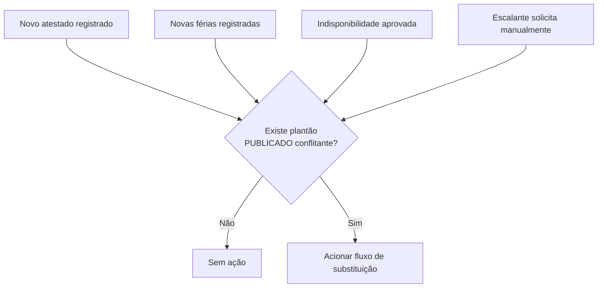
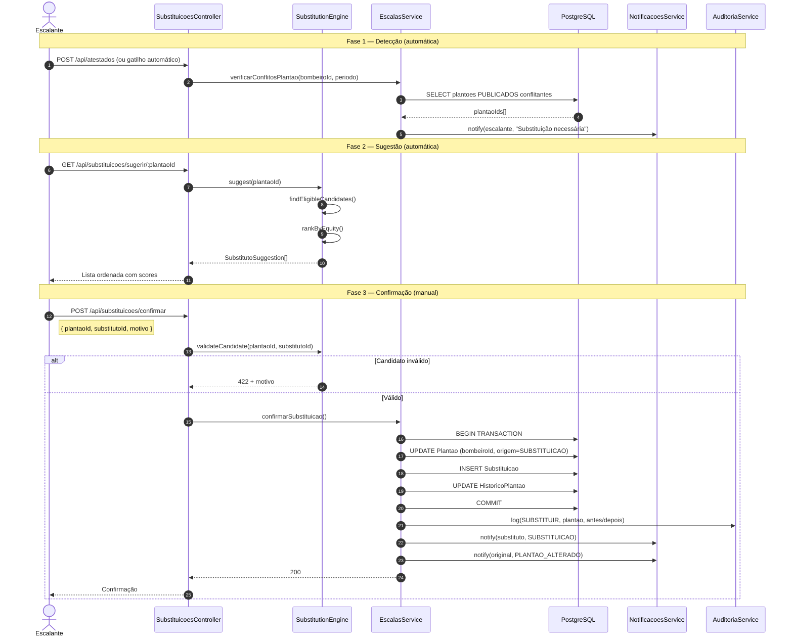
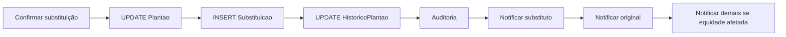
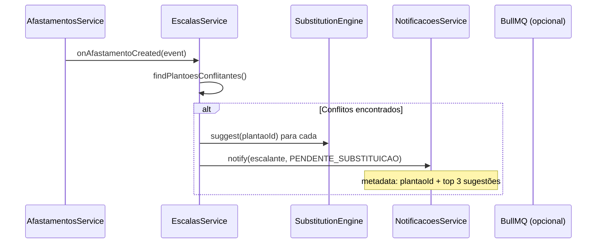
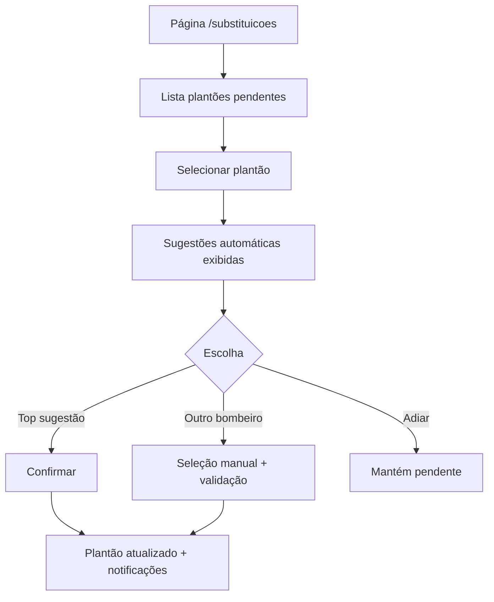

# Fluxo de Substituições Automáticas

**Versão:** 1.0  
**Módulos:** SubstitutionEngineModule, EscalasModule, AfastamentosModule, HistoricoModule, NotificacoesModule  
**Regras:** RN03, RN07–RN09, RN11, RN12  

---

## 1. Visão Geral

Quando um bombeiro escalado em plantão **já publicado** torna-se indisponível (atestado, férias emergenciais, indisponibilidade aprovada), o sistema **sugere substitutos elegíveis** ordenados por critério de justiça. A confirmação é sempre **humana** (escalante).

### Escopo "automático"
- **Automático:** cálculo e ranking de substitutos
- **Manual:** confirmação pelo escalante (RN11)

---

## 2. Gatilhos de Substituição



### Detecção de conflito

```
PARA cada plantão P onde:
  - escala.status = PUBLICADA
  - P.dataInicio BETWEEN afastamento.inicio AND afastamento.fim
  - P.bombeiroId = bombeiro afastado
→ Marcar P como PENDENTE_SUBSTITUICAO
→ Notificar escalante
```

---

## 3. Participantes

| Componente | Responsabilidade |
|------------|------------------|
| **SubstituicoesController** | Endpoints sugerir/confirmar |
| **SubstitutionEngineService** | Ranking de candidatos |
| **EligibilityService** | Reutilizado do Schedule Engine |
| **EquityScorerService** | Score adaptado para substituição |
| **EscalasService** | Atualiza plantão, registra substituição |
| **HistoricoService** | Atualiza histórico após confirmação |
| **NotificacoesService** | Notifica substituto e original |
| **AuditoriaService** | Log da substituição |

---

## 4. Fluxo Completo



---

## 5. Algoritmo de Ranking (`SubstitutionEngineService`)

```mermaid
flowchart TD
    START([suggest plantaoId]) --> LOAD[Carregar plantão + escala]
    LOAD --> ACTIVE[Listar bombeiros ATIVOS<br/>exceto original]
    ACTIVE --> FILTER[EligibilityService:<br/>filtrar elegíveis]

    FILTER --> EMPTY{Lista vazia?}
    EMPTY -->|Sim| NONE[Retornar [] + alerta DÉFICIT]
    EMPTY -->|Não| SCORE[Calcular score RN11]

    SCORE --> SORT[Ordenar ASC por score]
    SORT --> RETURN[Retornar top N candidatos<br/>default N=5]
    RETURN --> END([SubstitutoSuggestion[]])
    NONE --> END
```

### Critérios de elegibilidade (RN11)

| # | Critério | Verificação |
|---|----------|-------------|
| 1 | Não é o bombeiro original | `candidato.id != original.id` |
| 2 | Status ATIVO | RN13 |
| 3 | Sem férias no dia | RN07 |
| 4 | Sem atestado no dia | RN08 |
| 5 | Sem indispon. APROVADA | RN09 |
| 6 | Descanso 24h respeitado | RN03 |
| 7 | Não escalado em outro plantão no mesmo dia | RN01 |

---

## 6. Fórmula de Score (RN11)

Score **menor = melhor substituto**.

```
score = (historicoVermelha12m * 1000)     // se plantão VERMELHA
      + (plantoesMesAtual * 100)
      + (historicoTotal12m * 10)
      + (diasDesdeUltimoPlantao * -1)     // negativo = bonus por tempo ocioso
      + penalidadeDescansoApertado        // +500 se descanso exato mínimo
      + desempateMatricula
```

### Exemplo de resposta

```json
{
  "plantaoId": "uuid",
  "data": "2026-08-15",
  "tipo": "VERMELHA",
  "bombeiroOriginal": { "id": "...", "nome": "Silva" },
  "sugestoes": [
    {
      "rank": 1,
      "bombeiro": { "id": "...", "nome": "Santos" },
      "score": 1250,
      "motivos": ["Menor carga VERMELHA 12m (4)", "2 plantões no mês"]
    },
    {
      "rank": 2,
      "bombeiro": { "id": "...", "nome": "Oliveira" },
      "score": 1380,
      "motivos": ["5 plantões VERMELHA 12m", "1 plantão no mês"]
    }
  ],
  "alertas": []
}
```

---

## 7. Confirmação e Efeitos Colaterais



### Atualização do histórico

| Campo | Antes | Depois |
|-------|-------|--------|
| `HistoricoPlantao.bombeiroId` | Original | Substituto |
| `Plantao.bombeiroId` | Original | Substituto |
| `Plantao.origem` | * | SUBSTITUICAO |

> Registro de `Substituicao` preserva rastreabilidade do bombeiro original.

---

## 8. Validações na Confirmação

| Validação | Erro |
|-----------|------|
| Escala não PUBLICADA | 409 "Escala não publicada" |
| Plantão não pertence ao bombeiro original informado | 422 |
| Substituto não está na lista elegível | 422 + detalhe |
| Motivo vazio | 400 |
| Plantão VERMELHA sem motivo detalhado | 422 (RN12) |

---

## 9. Fluxo Automático de Detecção (Background)



Processamento síncrono no MVP; fila BullMQ se múltiplos conflitos.

---

## 10. Cenários de Borda

| Cenário | Comportamento |
|---------|---------------|
| Nenhum substituto elegível | Alerta `DEFICIT_SUBSTITUICAO` ao escalante; plantão fica descoberto |
| Substituto elegível mas viola equidade | Aparece na lista com flag `equidadeImpactada: true` |
| Múltiplos plantões do mesmo bombeiro no período | Um fluxo de substituição por plantão |
| Escalante escolhe candidato fora do top 5 | Permitido se elegível; registrar `escolhaManual: true` |
| Substituição em cascata | Novo substituto passa por mesma validação RN03 |

---

## 11. Endpoints

| Método | Rota | Descrição |
|--------|------|-----------|
| GET | `/api/substituicoes/pendentes` | Plantões aguardando substituição |
| GET | `/api/substituicoes/sugerir/:plantaoId` | Ranking automático |
| POST | `/api/substituicoes/confirmar` | Confirma troca |
| GET | `/api/substituicoes/historico` | Histórico de substituições |

---

## 12. Interface do Escalante



Ver também: [FLUXO-GERACAO-ESCALAS.md](./FLUXO-GERACAO-ESCALAS.md) · [FLUXO-NOTIFICACOES.md](./FLUXO-NOTIFICACOES.md)
